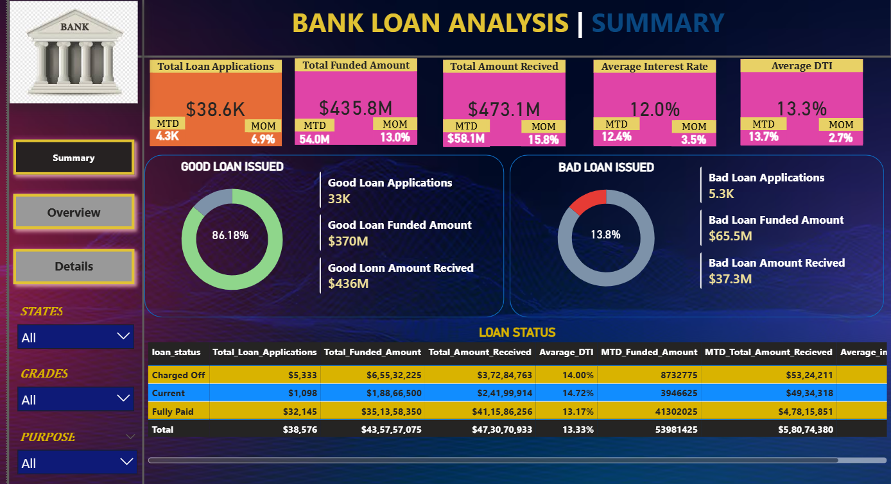
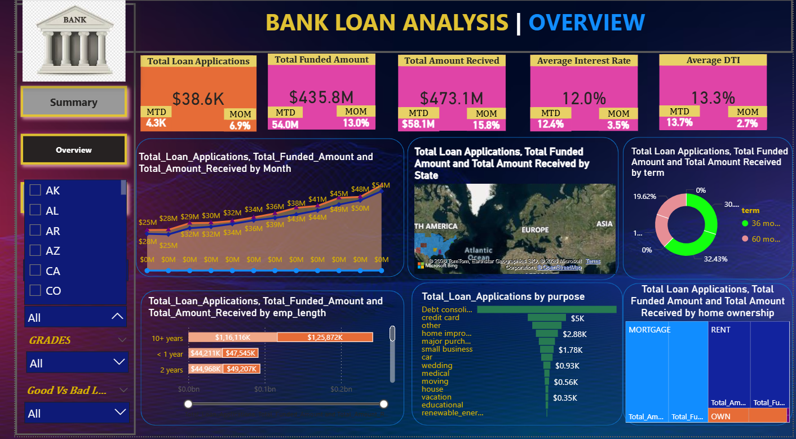
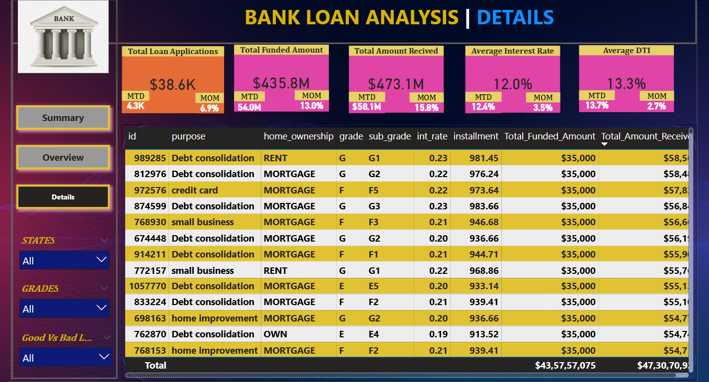

# 📊 Bank Loan Analysis Dashboard

## 📌 Project Overview
This project analyzes bank loan data to evaluate loan applications, funding distribution, repayment performance, and default risk. The objective is to generate actionable insights and support data-driven decision-making in the banking domain.

---

## 🛠️ Tools & Technologies Used
- Power BI (Dashboard Development & Data Modeling & data Celaning)
- SQL (Data Extraction & Querying)

---

## 📈 Key KPIs
- Total Loan Applications: 38.6K  
- Total Funded Amount: $435.8M  
- Total Amount Received: $473.1M  
- Average Interest Rate: 12%  
- Average DTI: 13.3%  
- Good Loan Ratio: 86.18%  
- Bad Loan Ratio: 13.8%  

---

## 📊 Dashboard Pages

### 1️⃣ Summary Page
- High-level KPI overview  
- Good vs Bad Loan analysis  
- Loan status breakdown (Charged Off, Current, Fully Paid)  
- Month-to-Date (MTD) and Month-over-Month (MoM) comparison  

### 2️⃣ Overview Page
- Monthly trend analysis of applications and funding  
- State-wise loan distribution (Map visualization)  
- Loan term analysis (36 months vs 60 months)  
- Loan purpose analysis  
- Employment length segmentation  
- Home ownership analysis  

### 3️⃣ Detailed Page
- Loan-level detailed data table  
- Drill-through analysis capability  
- Interactive filtering by State, Grade, Purpose, and Loan Status  

---

## 🔍 Key Business Insights
- Majority of loans fall under the "Fully Paid" category, indicating strong repayment performance.  
- Approximately 13.8% of loans represent high-risk or charged-off loans.  
- Debt consolidation is one of the primary loan purposes.  
- 36-month term loans are more common compared to 60-month loans.  
- Mortgage holders account for a significant share of total funded loans.  

---

## 🎯 Key Features
- Interactive slicers and filters  
- Dynamic KPI cards with MTD & MoM comparison  
- Risk segmentation (Good vs Bad loans)  
- Multi-page dashboard navigation  
- Business-focused financial analytics  

---

## 📷 Dashboard Preview

### Summary Page

### Overview Page

### Detailed Page

---

## 🚀 Project Outcome
This dashboard helps stakeholders monitor loan performance, assess financial risk, and make informed lending decisions using data visualization and analytical techniques.
